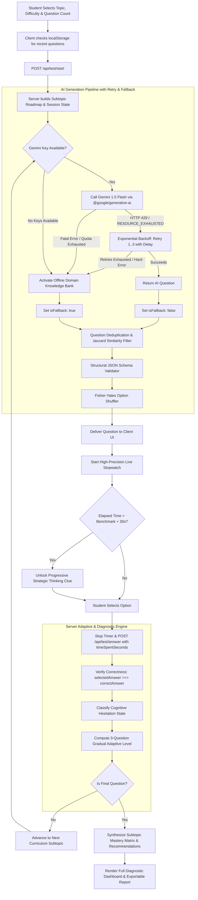

# SkillAssess AI — Comprehensive Project Architecture, Features & Tech Stack Guide

> **A Cognitive Adaptive Skill Assessment & Psychometric Diagnostic Testing Platform**

---

## 📖 1. Executive Summary & Core Mission

**SkillAssess AI** is an intelligent, full-stack adaptive diagnostic testing platform engineered to evaluate student subject proficiency across diverse disciplines while uncovering hidden conceptual misconceptions and cognitive drag.

Traditional static test engines present identical pre-baked questions in fixed orders, failing to adapt to individual student abilities and offering zero insight into mental retrieval effort. **SkillAssess AI** revolutionizes this paradigm through:
1. **Gradual Adaptive Difficulty Calibrations**: Progression requires proven mastery (3 consecutive correct answers at the current tier to level up).
2. **Cognitive Hesitation & Pacing Diagnostics**: Tracks exact solve time against standardized psychometric benchmarks to distinguish between intuitive mastery, deliberate reasoning, cognitive drag, and impulsive distractor traps.
3. **Google Gemini AI with Resilient Fallback**: Integrates Google Gemini via the `@google/generative-ai` SDK with automatic 429/RESOURCE_EXHAUSTED exponential backoff retries, backed by a comprehensive offline domain knowledge base.
4. **Session Anti-Repetition & Memory**: Strict token-similarity checks and cross-session memory guarantee zero duplicate or rephrased questions.
5. **12 Curated Technical Engineering Domains**: Exclusively focused on pure Computer Science & Software Engineering disciplines (JavaScript, Python, Java, C, C++, DSA, OOP, OS, Networks, DBMS/SQL, Web Dev, Software Engineering) with 100% domain-authentic inquiry.

---

## 🛠️ 2. Comprehensive Technology Stack

Every component of the platform is designed with modern, lightweight, high-performance web standards without unnecessary framework bloat:

```
+-----------------------------------------------------------------------------------------+
|                                    SKILLASSESS AI STACK                                |
+-----------------------------------------------------------------------------------------+
|  Frontend UI (SPA)    : Vanilla HTML5 Semantic Elements + Vanilla CSS3 Glassmorphism    |
|  Client Logic         : Vanilla JavaScript (ES6+), High-Precision Timer (performance.now)|
|  Backend Web Server   : Node.js (v18+ Native ES Modules) + Express.js REST Framework    |
|  AI Engines           : Google Gemini API (@google/generative-ai SDK)                   |
|  Resilience Layer     : Exponential Backoff Retry Engine + Offline Semantic Synthesizer |
|  Data & State Store   : In-Memory Map (Server Sessions) + LocalStorage (Client Memory)  |
|  Security & Config    : dotenv (Secure Environment Injection) + Native Crypto UUIDs     |
|  Validation & Shuffler: Schema Structural Verifier + Fisher-Yates Array Shuffler        |
+-----------------------------------------------------------------------------------------+
```

### **Backend & Core Engine**
- **Runtime Environment**: [Node.js](https://nodejs.org/) (v18+ with native ES module syntax `import`/`export`).
- **Web Framework**: [Express.js](https://expressjs.com/) (v4.19+) for routing REST API endpoints (`/api/test/start`, `/api/test/answer`, `/api/health`, `/api/domains`), request parsing, and static SPA delivery.
- **Session Identity**: Node.js native `crypto.randomUUID()` for cryptographically unique session IDs.
- **Environment & Secrets**: [`dotenv`](https://www.npmjs.com/package/dotenv) for API key management (`GEMINI_API_KEY`, `PORT`).
- **State Architecture**: In-memory `Map()` store maintaining active test sessions, question histories, tier streaks, and cognitive metrics.

### **Artificial Intelligence & LLM Integration**
- **Google Gemini API**: Official `@google/generative-ai` SDK querying `gemini-3.1-flash-lite` with calibrated temperature and strict JSON schema instructions.
- **Exponential Backoff Retry Engine**: Native asynchronous retry mechanism handling HTTP 429 rate limits with exponential delays ($1.5s \rightarrow 3.0s \rightarrow 6.0s + \text{jitter}$).
- **Smart Offline Knowledge Engine**: Curated technical banks covering all 12 core computer science and software engineering domains plus procedural algorithmic synthesis for arbitrary technical topics.

### **Frontend & Visual Design System**
- **Structure**: Semantic **HTML5** with accessibility landmarks (`role="alert"`, `aria-hidden`, semantic `<main>`, `<section>`, `<header>`).
- **Styling Architecture**: **Vanilla CSS3** with custom Design Tokens:
  - **Glassmorphism & Depth**: Multi-layer backdrop filters (`backdrop-filter: blur(12px)`), semi-transparent RGBA borders, and elevated box shadows.
  - **Color Palette**: Dark-mode palette using Slate backgrounds (`#0a0e17`, `#111827`, `#1e293b`), Indigo/Purple accents (`#6366f1`, `#a855f7`), Emerald success (`#10b981`), Rose danger (`#ef4444`), and Amber warning (`#f59e0b`).
  - **Typography**: [Google Fonts Inter](https://fonts.google.com/specimen/Inter) for typography and [Fira Code](https://fonts.google.com/specimen/Fira+Code) for monospace syntax.
  - **Micro-Animations**: Smooth cubic-bezier transitions, pulsing stopwatch thresholds, spinner loaders, and ripple hover states.
- **Client Application Logic**: **Vanilla JavaScript (ES6+)**:
  - `performance.now()` stopwatch measuring sub-second student reaction times.
  - Asynchronous `fetch` REST client for zero-reload single-page navigation.
  - `localStorage` memory for cross-session question deduplication.
  - Markdown/Code renderer converting raw backtick notation into syntax-highlighted blocks.
  - Native Web Clipboard API for instant diagnostic report sharing.

---

## 🔄 3. End-to-End System Workflow



---

## 🌟 4. Deep-Dive Feature Breakdown & Implementation

---

### Feature 1: Google Gemini AI Generation with Misconception Targeting

- **Purpose**: Dynamically generates unique diagnostic multiple-choice questions testing subtle conceptual traps rather than rote recall.
- **Tech Stack**: `@google/generative-ai` (Google Gemini 1.5 Flash), structured prompt engineering.
- **How It Works**:
  1. `buildPrompt()` constructs a system prompt instructing the AI to identify a genuine student misconception at the specified difficulty.
  2. Injects the target curriculum subtopic (e.g. `Cardiovascular Dynamics & Hemodynamics` under `Human Anatomy`).
  3. Strict rules enforce balanced option lengths ($\pm 10\%$ characters), 1 correct answer, 3 plausible distractors, a spoiler-free approach hint, and a benchmark solve time.
  4. Response is returned as raw JSON, stripped of markdown fences, and validated.

---

### Feature 2: Exponential Backoff & Automatic Rate Limit Retry Engine

- **Purpose**: Prevents test crashes when external AI APIs return HTTP 429 rate limit errors (frequent during rapid question requests).
- **Tech Stack**: JavaScript `Promise` timers (`sleep`), exponential math (`Math.pow(2, attempt)`), error classifier.
- **How It Works**:
  1. If Gemini returns a 429 or `RESOURCE_EXHAUSTED` status code, `callGemini()` catches the error before any fallback is triggered.
  2. Calculates an exponential backoff delay with random jitter:
     $$\text{Delay} = 1500\text{ms} \times 2^{(\text{attempt} - 1)} + \text{random}(0..500\text{ms})$$
  3. Logs the retry attempt in console: `[Gemini Rate Limit 429]: Retrying in 3240ms (Attempt 2/3)...`.
  4. Only if all 3 retries fail or if the account has an explicit quota error does it gracefully switch to the offline domain engine with `isFallback: true`.

---

### Feature 3: Session Anti-Duplication & Cross-Session Memory

- **Purpose**: Eliminates repeated or rephrased questions during a 15–30 question test or across consecutive test sessions.
- **Tech Stack**: Prompt negative constraints, Token-level Jaccard similarity algorithm, HTML5 `localStorage`.
- **How It Works**:
  1. **Prompt Invalidation**: `buildPrompt()` formats every previously asked question in the session into a numbered list: `PREVIOUSLY ASKED QUESTIONS (STRICTLY DO NOT REPEAT): 1. "..." 2. "..."`.
  2. **Jaccard Similarity Safety Net**: When a question is generated, `isQuestionDuplicate()` normalizes the text and computes word intersection over union:
     $$J(A, B) = \frac{|A \cap B|}{|A \cup B|}$$
     If $J(A, B) \ge 0.75$ against any previously asked question, the question is rejected and regenerated.
  3. **Cross-Session Memory**: The client stores recent question texts in `localStorage` under `skillAssess_recentQuestions_v4` and supplies them via `excludeQuestions` on new test starts.

---

### Feature 4: Domain-Aware Knowledge Engine & Clean Procedural Synthesizer

- **Purpose**: Provides high-accuracy offline question generation for both standard disciplines and arbitrary custom topics without relying on external internet or API access.
- **Tech Stack**: `questionBank.js`, Regex token classification, Domain archetypes.
- **How It Works**:
  1. **Topic Banks**: Pre-loaded with 250+ curated questions spanning:
     - *JavaScript & Modern Web*
     - *Python Programming*
     - *Java & JVM Architecture*
     - *C++ & Systems Engineering*
     - *Data Structures & Algorithms*
     - *SQL & Relational Databases*
     - *Human Anatomy & Biology*
     - *Mathematics & Calculus*
     - *Physics & Classical Mechanics*
  2. **Domain Detection (`detectDomainCategory`)**: Categorizes any user topic into `life_sciences`, `math_stats`, `physical_sciences`, `tech_cs`, or `general_humanities`. Uses word tokens to prevent false matches (e.g. "brain" or "soft tissue" are never falsely matched as `tech_cs`).
  3. **Clean Procedural Synthesis**: For unlisted custom topics (e.g. "Macroeconomics" or "Ancient Roman History"), generates discipline-authentic questions with zero software jargon.

---

### Feature 5: Gradual 3-Question Adaptive Difficulty Progression

- **Purpose**: Replaces erratic 1-question jumping with a gradual mastery progression model.
- **Tech Stack**: State streak tracker (`calculateGradualDifficulty` in `server.js`).
- **How It Works**:
  - **To Level Up** (e.g. Easy $\rightarrow$ Medium, or Medium $\rightarrow$ Hard): The student must achieve **3 consecutive correct answers** at the current difficulty tier (`tierStreak >= 3`).
  - **To Level Down** (e.g. Hard $\rightarrow$ Medium, or Medium $\rightarrow$ Easy): The student must miss **2 consecutive questions** at the current difficulty tier (`tierMisses >= 2`).
  - **HUD Progress Pill**: Displays live tier advancement progress (e.g. `Tier Progress: 2/3 to level up`).

---

### Feature 6: Curriculum Subtopic Roadmaps (10, 15, 20, 25, 30 Questions)

- **Purpose**: Ensures comprehensive subject coverage by rotating through structured subtopic roadmaps rather than asking random unorganized questions.
- **Tech Stack**: `getSubtopicRoadmap()` in `questionBank.js`.
- **How It Works**:
  - Automatically partitions the chosen topic into a roadmap of 10–30 subtopics.
  - Example for **Human Anatomy**:
    1. *Skeletal Structure & Bone Remodeling*
    2. *Muscular Biomechanics & Sliding Filaments*
    3. *Cardiovascular Dynamics & Hemodynamics*
    4. *Respiratory Mechanics & Alveolar Gas Exchange*
    5. *Nervous System, Neurons & Synapses*
    6. *Digestive Tract & Nutrient Absorption*
    7. *Renal Function & Fluid Osmolarity*
    8. *Endocrine Feedback & Hormonal Cascades*
    9. *Cellular Organelles, Mitosis & Meiosis*
    10. *Genetics, Transcription & Protein Translation*
  - The engine targets each question specifically to its scheduled subtopic.

---

### Feature 7: Progressive Strategic Thinking Hints (Benchmark + 30s)

- **Purpose**: Prevents student frustration and guides mental reasoning if stuck, without giving away the answer.
- **Tech Stack**: Per-question stopwatch timer, conditional UI reveal.
- **How It Works**:
  - When the question starts, the hint is locked: `Unlocks after 30s past target benchmark (55s)`.
  - If the student's elapsed time exceeds `benchmarkSeconds + 30`, the hint container pulses and unlocks: `💡 Thinking Approach Clue Unlocked`.
  - Displays a pedagogical mental model prompt (e.g. *"Differentiate between cells that 'build' (blasts) versus cells that 'cleave' or resorb (clasts) mineral matrix"*).

---

### Feature 8: High-Precision Stopwatch & Target Benchmark Widget

- **Purpose**: Tracks real-time cognitive pacing and provides immediate visual feedback on response speed.
- **Tech Stack**: `performance.now()`, `setInterval`, CSS `@keyframes pulseTimer`.
- **How It Works**:
  - Uses `performance.now()` for millisecond-accurate duration measurement.
  - Shows target benchmark (e.g. `⏱️ 00:18 / Target: 25s`).
  - At $\text{elapsed} > \text{benchmark}$: widget shifts to amber warning (`.timer-warning`).
  - At $\text{elapsed} \ge \text{benchmark} + 30s$: widget pulses red (`.timer-critical`) and triggers the hint unlock.

---

### Feature 9: Cognitive Hesitation Diagnostic Classifier

- **Purpose**: Diagnoses the student's cognitive state on every single question by combining accuracy with response speed.
- **Tech Stack**: `evaluateCognitiveState()` in `server.js`.
- **Diagnostic States**:
  | State | Condition | Meaning & Remediation |
  | :--- | :--- | :--- |
  | ⚡ **Fluent Mastery** | Correct & $\le \min(18s, \text{bench} \times 0.75)$ | Effortless conceptual recall and high fluency. |
  | ✓ **Solid Understanding** | Correct & On-pace with benchmark | Solid grounding within normal solve speed. |
  | ⏳ **Cognitive Drag / Hesitant** | Correct & $> \text{bench} + 25s$ | Correct answer achieved under high mental effort; speed drilling recommended. |
  | 🚨 **Impulsive Trap** | Incorrect & $\le 12s$ | Rushed answer; student fell for a common distractor trap. |
  | 🛑 **Critical Skill Gap** | Incorrect & $> \text{bench} + 25s$ | Prolonged struggle resulting in an incorrect answer; foundational revision required. |
  | ✗ **Concept Misconception** | Incorrect & within standard time | Standard conceptual gap in the targeted subtopic. |

---

### Feature 10: Balanced Option Lengths & Fisher-Yates Shuffling

- **Purpose**: Eliminates test-taking heuristics (where students guess the longest, most detailed option or notice patterns in answer letters).
- **Tech Stack**: Character count validator, Fisher-Yates shuffle algorithm (`shuffleOptions`).
- **How It Works**:
  - All 4 options are calibrated to roughly equal length ($\pm 10\%$) with matching grammatical structure.
  - Before sending to the client, the 4 options undergo an unbiased Fisher-Yates swap:
    ```javascript
    for (let i = copy.length - 1; i > 0; i--) {
      const j = Math.floor(Math.random() * (i + 1));
      [copy[i], copy[j]] = [copy[j], copy[i]];
    }
    ```
  - Correct answers are uniformly distributed across **A, B, C, and D**.

---

### Feature 11: Service Degradation Notification Banner

- **Purpose**: Ensures complete transparency so users always know whether questions are generated by real AI or the offline knowledge base.
- **Tech Stack**: `isFallback: boolean` metadata in API response, CSS animation banner.
- **How It Works**:
  - `/api/test/start` and `/api/test/answer` return `{ ..., isFallback: true/false }`.
  - If `isFallback: true`, the test HUD immediately displays:
    ```
    ⚠️ Question generation is temporarily degraded (using offline knowledge base)
    ```
  - If real AI is operating normally, the banner is hidden.

---

### Feature 12: Sub-Concept Matrix, Remediation & Report Export

- **Purpose**: Summarizes the test into actionable study recommendations and provides an easily shareable report.
- **Tech Stack**: Concept aggregation mapping, Web Clipboard API (`navigator.clipboard.writeText`).
- **How It Works**:
  - Aggregates performance by subtopic: accuracy %, total questions, and average solve time vs. benchmark.
  - Generates personalized study recommendations based on detected skill gaps and cognitive drag.
  - Includes review filters: **"All Questions"**, **"Mistakes Only"**, **"Hesitant / Review Needed"**.
  - One-click **"📋 Copy Diagnostic Report"** exports a clean Markdown report to clipboard.

---

## 📡 5. API Endpoint Specifications

### 1. `GET /api/health`
Health check endpoint reporting backend operational status.
- **Response**:
  ```json
  {
    "status": "healthy",
    "engine": "cognitive-adaptive-multi-domain",
    "hasGeminiKey": true,
    "activeSessions": 2
  }
  ```

### 2. `POST /api/test/start`
Initializes a new adaptive test session, generates the subtopic roadmap, and synthesizes Question 1.
- **Request Body**:
  ```json
  {
    "topic": "Human Anatomy",
    "numQuestions": 15,
    "startDifficulty": "easy",
    "excludeQuestions": ["..."]
  }
  ```
- **Response (200 OK)**:
  ```json
  {
    "sessionId": "48223fc2-9653-4318-bd83-50ecad197176",
    "questionNumber": 1,
    "totalQuestions": 15,
    "difficulty": "easy",
    "tierStreak": 0,
    "nextTierThreshold": 3,
    "question": "What is the primary anatomical function of osteoclasts in healthy human bone tissue?",
    "options": ["...", "...", "...", "..."],
    "conceptTag": "Skeletal Structure & Bone Remodeling",
    "targetSubtopic": "Skeletal Structure & Bone Remodeling",
    "subtopicRoadmap": ["Skeletal Structure...", "Muscular Biomechanics...", "..."],
    "approachHint": "Differentiate between cells that 'build' (blasts) versus cells that 'cleave' (clasts)...",
    "subCluster": "skeletal",
    "benchmarkSeconds": 20,
    "isFallback": true
  }
  ```

### 3. `POST /api/test/answer`
Submits an answer for the current question, evaluates cognitive state, computes adaptive progression, and returns either the next question or the final diagnostic report.
- **Request Body**:
  ```json
  {
    "sessionId": "48223fc2-9653-4318-bd83-50ecad197176",
    "selectedAnswer": "They break down and resorb old bone matrix...",
    "timeSpentSeconds": 18
  }
  ```
- **Intermediate Response (Finished: false)**:
  ```json
  {
    "finished": false,
    "questionNumber": 2,
    "totalQuestions": 15,
    "difficulty": "easy",
    "tierStreak": 1,
    "nextTierThreshold": 3,
    "question": "Which blood vessel carries oxygen-rich blood...",
    "options": ["...", "...", "...", "..."],
    "conceptTag": "Cardiovascular Dynamics & Hemodynamics",
    "targetSubtopic": "Cardiovascular Dynamics & Hemodynamics",
    "benchmarkSeconds": 20,
    "wasCorrect": true,
    "correctAnswer": "...",
    "explanation": "...",
    "timeSpentSeconds": 18,
    "timeDelta": -2,
    "cognitiveDiagnosis": {
      "type": "mastered",
      "label": "Fluent Mastery",
      "badgeClass": "diag-mastered",
      "icon": "⚡",
      "description": "Fast & accurate (18s vs 20s benchmark). High conceptual fluency."
    },
    "isFallback": true
  }
  ```
- **Final Summary Response (Finished: true)**:
  ```json
  {
    "finished": true,
    "score": 15,
    "totalQuestions": 15,
    "wasCorrect": true,
    "breakdown": [ "..." ],
    "difficultyProgression": ["easy", "easy", "easy", "medium", "medium", "medium", "hard", "..."],
    "conceptMatrix": [
      { "concept": "Skeletal Structure...", "total": 1, "correct": 1, "accuracy": 100, "avgTime": 18, "avgBenchmark": 20 }
    ],
    "cognitiveSummary": { "mastered": 10, "solid": 5, "hesitant": 0, "impulsive": 0, "skillGaps": 0 },
    "recommendations": ["🏆 Exceptional Mastery: Flawless conceptual accuracy and optimal pacing across all subtopics!"]
  }
  ```

---

## 📁 6. Directory Structure & File Map

```
Adaptive ques bank/
├── .env                     # Local API keys (GEMINI_API_KEY, PORT)
├── .env.example             # Template for environment configuration
├── package.json             # Node dependencies and execution scripts
├── index.js                 # Standalone CLI demo generator script
├── server.js                # Express REST API, cognitive state evaluation & session engine
├── questionGenerator.js     # AI coordinator, 429 exponential backoff retries & deduplication
├── questionBank.js          # Multi-domain knowledge base & procedural synthesizer
├── validator.js             # Schema and structural validation engine
├── test-flow.js             # End-to-end multi-domain automated test suite
├── PROJECT_OVERVIEW.md      # Complete architectural, features & technical documentation
├── README.md                # Quickstart documentation & overview
└── public/
    ├── index.html           # Single Page Application HTML markup
    ├── app.js               # Client state, live stopwatch, progressive hints & review UI
    └── style.css            # Dark mode glassmorphism design system & animations
```

---

## 🚀 7. Running & Verifying the Application

### 1. Install Dependencies
```bash
npm install
```

### 2. Configure Environment Keys (Optional)
Copy `.env.example` to `.env` and add your Gemini API key:
```env
# Google Gemini API Key (https://aistudio.google.com/apikey)
GEMINI_API_KEY=your_gemini_key_here
PORT=3000
```
*(If no API keys are provided, the platform seamlessly runs on the Domain-Aware Offline Knowledge Engine).*

### 3. Start the Web Server
```bash
npm start
```
Open your browser at `http://localhost:3000`.

### 4. Run Automated Integration Verification
```bash
node test-flow.js
```
Runs a complete 15-question test on "JavaScript" and a 15-question test on "Human Anatomy", verifying 0% duplicates, difficulty trajectory, and 100% domain relevance.