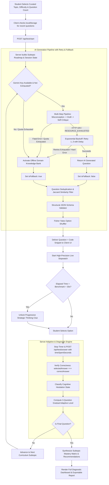

# SkillAssess AI — Comprehensive Project Architecture, Features & Tech Stack Guide

> **A Cognitive Adaptive Skill Assessment & Psychometric Diagnostic Testing Platform for Technical Disciplines**

---

## 📖 1. Executive Summary & Core Mission

**SkillAssess AI** is an intelligent, full-stack adaptive diagnostic testing platform engineered to evaluate student proficiency across core **Software Engineering and Computer Science disciplines** while diagnosing subtle conceptual misconceptions and cognitive retrieval drag.

Traditional static test engines present identical pre-baked questions in fixed sequences, failing to adapt to individual student abilities and offering zero insight into mental retrieval effort. **SkillAssess AI** transforms this paradigm through:

1. **Misconception-First Multi-Step AI Pipeline**: Generates questions via a 4-step reflective pipeline:
   - *Step 1: Misconception Identification* (AI analyzes real-world conceptual pitfalls and selects a targeted misconception).
   - *Step 2: Draft Generation* (AI constructs the question and distractor traps specifically around that misconception).
   - *Step 3: Self-Critique & Quality Revision* (AI reviews and refines the draft against psychometric checklists).
   - *Step 4: Finalization* (Schema normalization, balanced option lengths, and unbiased option shuffling).
2. **Code-Flavored Question Variety**: Dynamically varies question formats between **Code Output**, **Bug Hunt**, **Fill-in-the-Blank**, and **Pure Theory**, with clean structural separation between question text and syntax-highlighted code blocks (`hasCode`, `codeSnippet`).
3. **12 Curated Technical Disciplines**: Exclusively focused on core engineering domains (JavaScript, Python, Java, C, C++, DSA, OOP, OS, Networks, DBMS/SQL, Web Dev, Software Engineering).
4. **Gradual Adaptive Difficulty Calibrations**: Progression requires proven mastery (**3 consecutive correct answers** at the current tier to level up; **2 consecutive misses** to drop).
5. **Cognitive Hesitation & Pacing Diagnostics**: Tracks exact solve time against standardized psychometric benchmarks to distinguish between *Fluent Mastery*, *Solid Understanding*, *Cognitive Drag*, *Impulsive Distractor Traps*, and *Critical Skill Gaps*.
6. **Resilient Dual-Engine Architecture**: Queries Google Gemini (`gemini-3.1-flash-lite`) with automatic 429/`RESOURCE_EXHAUSTED` exponential backoff retries, backed by a comprehensive 12-domain offline knowledge base in [questionBank.js](file:///c:/Users/anany/OneDrive/Desktop/Adaptive%20ques%20bank/questionBank.js).
7. **Session Anti-Repetition & Memory**: Strict token-similarity checks and cross-session local storage memory guarantee zero duplicate or rephrased questions.

---

## 🛠️ 2. Comprehensive Technology Stack

Every component of the platform is designed with modern, lightweight, high-performance web standards without framework bloat:

```
+-----------------------------------------------------------------------------------------+
|                                    SKILLASSESS AI STACK                                |
+-----------------------------------------------------------------------------------------+
|  Frontend UI (SPA)    : Vanilla HTML5 Semantic Elements + Vanilla CSS3 Glassmorphism    |
|  Client Logic         : Vanilla JavaScript (ES6+), High-Precision Timer (performance.now)|
|  Backend Web Server   : Node.js (v18+ Native ES Modules) + Express.js REST Framework    |
|  AI Pipeline Engine   : Google Gemini API (@google/generative-ai SDK, Multi-Step/Single)|
|  Resilience Layer     : Exponential Backoff Retry Engine + Offline Semantic Bank        |
|  Data & State Store   : In-Memory Map (Server Sessions) + LocalStorage (Client Memory)  |
|  Security & Config    : dotenv (Secure Environment Injection) + Native Crypto UUIDs     |
|  Validation & Shuffler: Schema Structural Verifier + Fisher-Yates Array Shuffler        |
+-----------------------------------------------------------------------------------------+
```

### **Backend & Core Engine**
- **Runtime Environment**: [Node.js](https://nodejs.org/) (v18+ with native ES module syntax `import`/`export`).
- **Web Framework**: [Express.js](https://expressjs.com/) (v4.19+) for routing REST API endpoints (`/api/domains`, `/api/test/start`, `/api/test/answer`, `/api/health`), request parsing, and static SPA delivery.
- **Session Identity**: Node.js native `crypto.randomUUID()` for cryptographically unique session IDs.
- **Environment & Secrets**: [`dotenv`](https://www.npmjs.com/package/dotenv) for API key management (`GEMINI_API_KEY`, `GEMINI_MODEL`, `PORT`).
- **State Architecture**: In-memory `Map()` store maintaining active test sessions, question histories, tier streaks, and cognitive metrics.

### **Artificial Intelligence & LLM Integration**
- **Google Gemini API**: Official `@google/generative-ai` SDK querying `gemini-3.1-flash-lite` with calibrated temperature and strict JSON schema instructions.
- **Multi-Step Generation Pipeline**: Self-reflective 4-step pipeline (Misconception Analysis $\rightarrow$ Targeted Draft $\rightarrow$ Self-Critique $\rightarrow$ Finalize).
- **Exponential Backoff Retry Engine**: Native asynchronous retry mechanism handling HTTP 429 rate limits with exponential delays ($1.5s \rightarrow 3.0s \rightarrow 6.0s + \text{jitter}$).
- **Smart Offline Knowledge Engine**: Curated technical banks covering all 12 core computer science and software engineering domains plus procedural synthesis for arbitrary technical topics.

### **Frontend & Visual Design System**
- **Structure**: Semantic **HTML5** with accessibility landmarks (`role="alert"`, `aria-hidden`, semantic `<main>`, `<section>`, `<header>`).
- **Styling Architecture**: **Vanilla CSS3** with custom Design Tokens:
  - **Glassmorphism & Depth**: Multi-layer backdrop filters (`backdrop-filter: blur(12px)`), semi-transparent RGBA borders, and elevated box shadows.
  - **Color Palette**: Dark-mode palette using Slate backgrounds (`#0a0e17`, `#111827`, `#1e293b`), Indigo/Purple accents (`#6366f1`, `#a855f7`), Emerald success (`#10b981`), Rose danger (`#ef4444`), and Amber warning (`#f59e0b`).
  - **Typography**: [Google Fonts Inter](https://fonts.google.com/specimen/Inter) for typography and [Fira Code](https://fonts.google.com/specimen/Fira+Code) for monospace code syntax.
  - **Micro-Animations**: Smooth cubic-bezier transitions, pulsing stopwatch thresholds, spinner loaders, and ripple hover states.
- **Client Application Logic**: **Vanilla JavaScript (ES6+)**:
  - `performance.now()` stopwatch measuring sub-second student reaction times.
  - Asynchronous `fetch` REST client for zero-reload single-page navigation.
  - `localStorage` memory for cross-session question deduplication.
  - Dedicated code block container rendering clean syntax-highlighted snippets with line-numbered monospace styling.
  - Native Web Clipboard API for instant diagnostic report sharing.

---

## 🎯 3. The 12 Curated Technical Domains

The platform strictly evaluates 12 technical engineering domains, defined centrally in [server.js](file:///c:/Users/anany/OneDrive/Desktop/Adaptive%20ques%20bank/server.js) and backed by curated subtopic roadmaps in [questionBank.js](file:///c:/Users/anany/OneDrive/Desktop/Adaptive%20ques%20bank/questionBank.js):

| # | Technical Domain | Key Curriculum Subtopics | Code Styles Supported |
|---|:---|:---|:---:|
| 1 | **JavaScript Programming** | Scopes, Hoisting, Closures, Prototypes, Event Loop, Microtasks, Async/Await, DOM | ✅ Code Output, Bug Hunt, Fill Blank, Theory |
| 2 | **Python Programming** | Mutability, Scopes, LEGB, Generators, Dunder Methods, Decorators, GIL, Asyncio | ✅ Code Output, Bug Hunt, Fill Blank, Theory |
| 3 | **Java Programming** | JVM Architecture, Bytecode, Interfaces, Collections, Concurrency, Generics, Virtual Threads | ✅ Code Output, Bug Hunt, Fill Blank, Theory |
| 4 | **C Programming Language** | Pointers, Dynamic Memory (`malloc`/`free`), Structs, Bitwise, Preprocessor, Memory Layout | ✅ Code Output, Bug Hunt, Fill Blank, Theory |
| 5 | **C++ Programming Language** | References, RAII, Virtual Tables, Smart Pointers, Move Semantics, Templates, STL | ✅ Code Output, Bug Hunt, Fill Blank, Theory |
| 6 | **Data Structures & Algorithms (DSA)** | Arrays, Two Pointers, Hashing, Trees, BSTs, Heaps, Graphs, DP, Sorting & Search | ✅ Code Output, Bug Hunt, Fill Blank, Theory |
| 7 | **Object-Oriented Programming (OOP) Concepts** | Encapsulation, Inheritance, Polymorphism, SOLID Principles, Design Patterns | ✅ Code Output, Bug Hunt, Fill Blank, Theory |
| 8 | **Operating Systems Concepts** | Processes, Threads, CPU Scheduling, Mutexes, Deadlocks, Paging, Virtual Memory, Inodes | ❌ Pure Theoretical |
| 9 | **Computer Networks Concepts** | OSI/TCP-IP Models, Ethernet, ARP, Subnetting, Routing, TCP/UDP, DNS, TLS/SSL, Sockets | ❌ Pure Theoretical |
| 10 | **Database Management Systems (DBMS) & SQL** | WHERE/HAVING, Joins, Subqueries/CTEs, ACID, Indexing & Sargability, Window Functions | ✅ SQL Query Output, Bug Hunt, Theory |
| 11 | **Web Development Fundamentals** | Semantic HTML5, CSS Box Model, Flexbox/Grid, Cascade Specificity, DOM, CORS, CSP | ✅ HTML/CSS/JS Output, Bug Hunt, Theory |
| 12 | **Software Engineering Basics** | SDLC (Agile/Scrum/Kanban), Git Version Control, Architecture, TDD, CI/CD, Technical Debt | ❌ Pure Theoretical |

---

## 🔄 4. End-to-End System Workflow



---

## 🌟 5. Deep-Dive Feature Breakdown & Implementation

---

### Feature 1: Multi-Step Misconception AI Pipeline

- **Purpose**: Generates high-discriminating diagnostic questions that target authentic student conceptual pitfalls rather than trivial syntax recall.
- **Tech Stack**: `@google/generative-ai` (`gemini-3.1-flash-lite`), 4-step pipeline in [questionGenerator.js](file:///c:/Users/anany/OneDrive/Desktop/Adaptive%20ques%20bank/questionGenerator.js#L579-L680).
- **How It Works**:
  1. **Step 1 (Misconception Identification)**: AI analyzes the topic, target subtopic, and difficulty to discover 2–3 genuine mental traps (e.g. *"Confusing lexical scope with dynamically bound this"*), selecting the most diagnostic trap.
  2. **Step 2 (Targeted Draft Generation)**: AI generates a question prompt, a single correct answer, and distractors specifically engineered so that students with that misconception fall into the trap.
  3. **Step 3 (Self-Critique & Review)**: AI critically reviews its own draft against psychometric rules (unambiguous correctness, balanced character lengths, plausible distractors, spoiler-free hint). If flawed, it revises the question automatically.
  4. **Step 4 (Finalization)**: Normalizes output schema, synchronizes subtopics, and applies option shuffling.

---

### Feature 2: Code-Flavored Variety & Clean Code Separation

- **Purpose**: For programming domains, provides real-world engineering problem types while keeping code cleanly separated from text.
- **Tech Stack**: `isCodeApplicableDomain()` in [questionGenerator.js](file:///c:/Users/anany/OneDrive/Desktop/Adaptive%20ques%20bank/questionGenerator.js#L83), `public/app.js` code renderer.
- **Question Styles**:
  - `code_output`: *"What is the output of this code snippet?"*
  - `code_bug`: *"Which line contains a subtle logical bug or race condition?"*
  - `fill_blank`: *"Which expression correctly completes the placeholder `____` to achieve the desired result?"*
  - `pure_theory`: High-level conceptual inquiry for architectural principles.
- **Clean Schema Separation**:
  - `hasCode: boolean`
  - `codeSnippet: string` (Raw, unpolluted code snippet rendered inside a dedicated dark monospace container with line numbers).

---

### Feature 3: Exponential Backoff & Automatic Rate Limit Retry Engine

- **Purpose**: Prevents test interruptions when external AI APIs encounter transient load or HTTP 429 rate limit errors.
- **Tech Stack**: Asynchronous sleep backoff (`executeGeminiPrompt` in [questionGenerator.js](file:///c:/Users/anany/OneDrive/Desktop/Adaptive%20ques%20bank/questionGenerator.js#L481)).
- **How It Works**:
  1. Catches HTTP 429, `RESOURCE_EXHAUSTED`, 503, or transient network errors.
  2. Calculates an exponential backoff delay with randomized jitter:
     $$\text{Delay} = 1500\text{ms} \times 2^{(\text{attempt} - 1)} + \text{random}(0..500\text{ms})$$
  3. Automatically retries up to 3 times before gracefully switching to the offline curated bank with `isFallback: true`.

---

### Feature 4: Session Anti-Duplication & Cross-Session Memory

- **Purpose**: Eliminates repeated or rephrased questions during a test or across consecutive test sessions.
- **Tech Stack**: Prompt negative constraints, Token-level Jaccard similarity algorithm in [validator.js](file:///c:/Users/anany/OneDrive/Desktop/Adaptive%20ques%20bank/validator.js), HTML5 `localStorage`.
- **How It Works**:
  1. **Prompt Invalidation**: Lists all previously asked questions in the test session inside Gemini's prompt with strict negative instructions.
  2. **Jaccard Similarity Check**: Normalized text comparison:
     $$J(A, B) = \frac{|A \cap B|}{|A \cup B|}$$
     If $J(A, B) \ge 0.75$, the question is rejected and regenerated.
  3. **Cross-Session Memory**: The client persists recent question identifiers in `localStorage` and submits them via `excludeQuestions` when starting a new session.

---

### Feature 5: 12-Domain Curated Knowledge Bank & Fallback Engine

- **Purpose**: Guarantees zero downtime by providing 65+ hand-curated questions across all 12 technical domains with complete subtopic roadmaps.
- **Tech Stack**: [questionBank.js](file:///c:/Users/anany/OneDrive/Desktop/Adaptive%20ques%20bank/questionBank.js).
- **How It Works**:
  - Pre-loaded with psychometrically calibrated questions across `easy`, `medium`, and `hard` tiers for all 12 domains.
  - Used actively on *every* session to construct the curriculum roadmap (`getSubtopicRoadmap()`), and served as an instant local fallback if Gemini is unreachable or rate-limited.
  - Includes a **Procedural Engineering Synthesizer** for arbitrary unlisted subtopics.

---

### Feature 6: Gradual 3-Question Adaptive Difficulty Progression

- **Purpose**: Replaces erratic 1-question bouncing with a gradual mastery progression model.
- **Tech Stack**: `calculateGradualDifficulty()` in [server.js](file:///c:/Users/anany/OneDrive/Desktop/Adaptive%20ques%20bank/server.js#L140).
- **How It Works**:
  - **Level Up** (e.g. Easy $\rightarrow$ Medium, or Medium $\rightarrow$ Hard): The student must achieve **3 consecutive correct answers** at the current tier (`tierStreak >= 3`).
  - **Level Down** (e.g. Hard $\rightarrow$ Medium, or Medium $\rightarrow$ Easy): The student must miss **2 consecutive questions** at the current tier (`tierMisses >= 2`).
  - **HUD Progress Pill**: Displays live tier advancement progress (e.g. `Tier Progress: 2/3 to level up`).

---

### Feature 7: Progressive Strategic Thinking Hints (Benchmark + 30s)

- **Purpose**: Prevents student frustration and guides mental reasoning if stuck, without revealing the correct option.
- **Tech Stack**: Per-question stopwatch timer, conditional UI reveal in `public/app.js`.
- **How It Works**:
  - When the question starts, the hint is locked: `Unlocks after 30s past target benchmark (50s)`.
  - If the student's elapsed time exceeds `benchmarkSeconds + 30`, the hint container unlocks with a subtle pulse animation: `💡 Thinking Approach Clue Unlocked`.
  - Displays a pedagogical mental model prompt (e.g. *"Think about happens-before memory visibility: what happens when one core modifies a variable cached in its L1 cache?"*).

---

### Feature 8: Cognitive Hesitation Diagnostic Classifier

- **Purpose**: Diagnoses cognitive state on every question by combining correctness with response time.
- **Tech Stack**: `evaluateCognitiveState()` in [server.js](file:///c:/Users/anany/OneDrive/Desktop/Adaptive%20ques%20bank/server.js#L170).
- **Diagnostic States**:
  | State | Condition | Meaning & Remediation |
  | :--- | :--- | :--- |
  | ⚡ **Fluent Mastery** | Correct & $\le \min(18s, \text{bench} \times 0.75)$ | Effortless recall and high conceptual fluency. |
  | ✓ **Solid Understanding** | Correct & On-pace with benchmark | Solid grounding within normal solve speed. |
  | ⏳ **Cognitive Drag / Hesitant** | Correct & $> \text{bench} + 25s$ | Correct answer achieved under high mental effort; speed drilling recommended. |
  | 🚨 **Impulsive Trap** | Incorrect & $\le 12s$ | Rushed answer; student fell into a targeted distractor trap. |
  | 🛑 **Critical Skill Gap** | Incorrect & $> \text{bench} + 25s$ | Prolonged struggle resulting in an incorrect answer; foundational revision required. |
  | ✗ **Concept Misconception** | Incorrect & within standard time | Conceptual flaw in the targeted subtopic. |

---

### Feature 9: Sub-Concept Matrix, Remediation & Report Export

- **Purpose**: Summarizes the test into actionable study recommendations and provides an easily shareable report.
- **Tech Stack**: Concept aggregation mapping, Web Clipboard API (`navigator.clipboard.writeText`).
- **How It Works**:
  - Aggregates performance by subtopic: accuracy %, total questions, and average solve time vs. benchmark.
  - Generates personalized recommendations based on detected skill gaps and cognitive drag.
  - Includes review filters: **"All Questions"**, **"Mistakes Only"**, **"Hesitant / Review Needed"**.
  - One-click **"📋 Copy Diagnostic Report"** exports a clean Markdown report to clipboard.

---

## 📡 6. API Endpoint Specifications

### 1. `GET /api/domains`
Returns the single source of truth list of 12 curated technical domains.
- **Response**:
  ```json
  {
    "domains": [
      "JavaScript Programming",
      "Python Programming",
      "Java Programming",
      "C Programming Language",
      "C++ Programming Language",
      "Data Structures & Algorithms (DSA)",
      "Object-Oriented Programming (OOP) Concepts",
      "Operating Systems Concepts",
      "Computer Networks Concepts",
      "Database Management Systems (DBMS) & SQL",
      "Web Development Fundamentals (HTML, CSS, JavaScript Basics)",
      "Software Engineering Basics (SDLC, Version Control, etc.)"
    ],
    "count": 12
  }
  ```

### 2. `GET /api/health`
Health check endpoint reporting backend and AI operational status.
- **Response**:
  ```json
  {
    "status": "healthy",
    "engine": "cognitive-adaptive-multi-domain",
    "hasGeminiKey": true,
    "activeSessions": 1
  }
  ```

### 3. `POST /api/test/start`
Initializes a new adaptive test session, generates the subtopic roadmap, and synthesizes Question 1.
- **Request Body**:
  ```json
  {
    "topic": "JavaScript Programming",
    "numQuestions": 15,
    "startDifficulty": "easy",
    "excludeQuestions": ["..."]
  }
  ```
- **Response (200 OK)**:
  ```json
  {
    "sessionId": "48223fc2-9653-4318-bd83-50ecad197176",
    "questionNumber": 1,
    "totalQuestions": 15,
    "difficulty": "easy",
    "tierStreak": 0,
    "nextTierThreshold": 3,
    "question": "What is the key functional difference between let and var variable declarations in JavaScript?",
    "hasCode": false,
    "codeSnippet": "",
    "options": ["...", "...", "...", "..."],
    "subTopic": "Scopes, Hoisting & the TDZ",
    "conceptTag": "Scopes, Hoisting & the TDZ",
    "targetSubtopic": "Scopes, Hoisting & the TDZ",
    "subtopicRoadmap": ["Scopes, Hoisting...", "Closures...", "..."],
    "approachHint": "Think about scope inside an if (true) block: which variable leaks outside curly braces?",
    "subCluster": "scopes_hoisting",
    "benchmarkSeconds": 20,
    "isFallback": false
  }
  ```

### 4. `POST /api/test/answer`
Submits an answer, evaluates cognitive state, computes adaptive progression, and returns either the next question or the final diagnostic report.
- **Request Body**:
  ```json
  {
    "sessionId": "48223fc2-9653-4318-bd83-50ecad197176",
    "selectedAnswer": "let is block-scoped and temporal dead zone bound...",
    "timeSpentSeconds": 18
  }
  ```
- **Intermediate Response (`finished: false`)**:
  ```json
  {
    "finished": false,
    "questionNumber": 2,
    "totalQuestions": 15,
    "difficulty": "easy",
    "tierStreak": 1,
    "nextTierThreshold": 3,
    "question": "What will be printed to the console when executing the following snippet?",
    "hasCode": true,
    "codeSnippet": "console.log(typeof null);",
    "options": ["...", "...", "...", "..."],
    "subTopic": "Data Types, Coercion & Truthiness",
    "benchmarkSeconds": 18,
    "wasCorrect": true,
    "correctAnswer": "'object' due to a legacy 31-bit type tag bug...",
    "explanation": "...",
    "timeSpentSeconds": 18,
    "timeDelta": -2,
    "cognitiveDiagnosis": {
      "type": "mastered",
      "label": "Fluent Mastery",
      "badgeClass": "diag-mastered",
      "icon": "⚡",
      "description": "Fast & accurate (18s vs 20s benchmark). High conceptual fluency."
    },
    "isFallback": false
  }
  ```

---

## 📁 7. Directory Structure & File Map

```
Adaptive ques bank/
├── .env                     # Local API keys (GEMINI_API_KEY, GEMINI_MODEL, PORT)
├── .env.example             # Template for environment configuration
├── package.json             # Node dependencies and execution scripts
├── index.js                 # Standalone CLI demo generator script
├── server.js                # Express REST API, cognitive state evaluation & session store
├── questionGenerator.js     # Multi-step AI pipeline, 429 exponential backoff & deduplication
├── questionBank.js          # 12-domain technical knowledge base & procedural synthesizer
├── validator.js             # Schema validation and Jaccard anti-duplication engine
├── test-flow.js             # End-to-end multi-question adaptive test verification
├── test-domain-scoping.js   # 12-domain scoping & validation test suite
├── test-c-and-domains.js    # C language deep test & domain spot-checker
├── test-pipeline.js         # Multi-step AI pipeline unit test suite
├── test-question-bank.js    # Question bank schema & integrity test suite
├── test-frontend-dom.js     # Headless DOM and UI state unit test suite
├── verify-frontend-suite.js # Comprehensive frontend browser verification suite
├── PROJECT_OVERVIEW.md      # Complete architectural, features & technical documentation
├── README.md                # Quickstart documentation & overview
└── public/
    ├── index.html           # Single Page Application HTML markup
    ├── app.js               # Client state, timer, code renderer & review UI
    └── style.css            # Dark mode glassmorphism design system & animations
```

---

## 🚀 8. Running & Verifying the Application

### 1. Install Dependencies
```bash
npm install
```

### 2. Configure Environment Keys
Create a `.env` file with your Gemini API key:
```env
GEMINI_API_KEY=your_gemini_api_key_here
GEMINI_MODEL=gemini-3.1-flash-lite
PORT=3000
```
*(If no API keys are provided or quota is exhausted, the platform runs on the local 12-domain knowledge engine).*

### 3. Start the Web Server
```bash
npm start
```
Open your browser at `http://localhost:3000`.

### 4. Run the Automated Verification Test Suites
```bash
# 1. Verify 12-domain question bank integrity
node test-question-bank.js

# 2. Verify domain scoping & REST API
node test-domain-scoping.js

# 3. Verify C language & domain spot-checking
node test-c-and-domains.js

# 4. Verify multi-step AI pipeline
node test-pipeline.js

# 5. Verify full end-to-end adaptive flow
node test-flow.js
```
